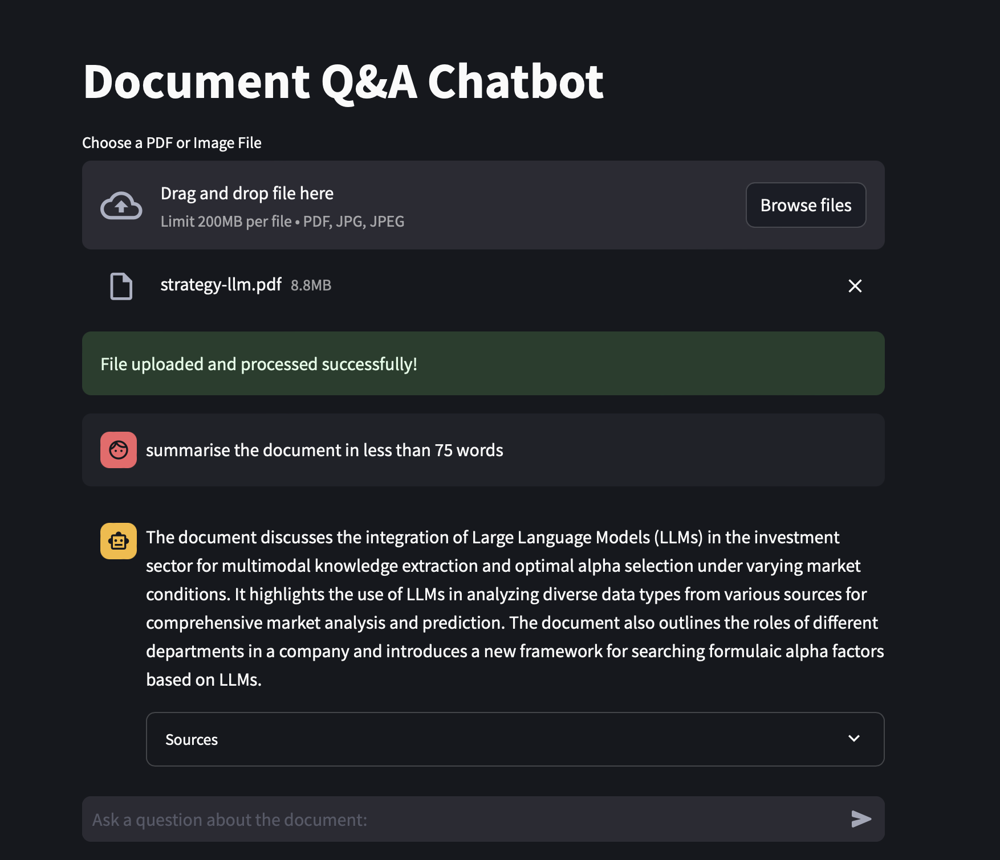

# document-q-a

**Description** :
This application is a basic document question-answering system that leverages state-of-the-art Language Models - gpt-4o. It allows users to upload documents and ask questions about their content, receiving accurate and context-aware answers.

**Features**:

- Document upload and processing (supports PDF files) 
- Natural language question answering 
- Adaptive Retrieval-Augmented Generation (RAG) for improved accuracy - compresssing the chunks 
- Vector search using FAISS
- Feedback loop for continuous improvement
- Advanced post-processing including text splitting, summarizing docs.

**Architecture**


**Technologies Used** :

- LLM Model: GPT-4 (via OpenAI API)
- Embedding Model: OpenAI Embeddings
- Vector Store: FAISS (Facebook AI Similarity Search)
- LLM Orchestration: Langchain
- Document Processing: PyPDFLoader for PDF handling, UnstructuredImage Loader for jpg and jpeg
- RAG Implementation: Adaptive RAG for dynamic information retrieval
- Web Framework: Streamlit
- Language: Python

**Setup and Installation**

Clone the repository: ```git clone https://github.com/yourusername/your-repo-name.git```
```cd your-repo-name```
Install dependencies:
```pip install -r requirements.txt```

Set up your OpenAI API key in a .env file or as an environment variable
Run the Streamlit app:
```streamlit run app.py```


**Usage and Example**

Upload your PDF document through the web interface,
Ask questions about the document in natural language,
Receive AI-generated answers based on the document's content,



**How It Works**

- Document Processing: Uploaded PDFs are processed using PyPDFLoader
- Embedding: Document content is embedded using OpenAI's embedding model
- Indexing: FAISS is used to create a searchable index of the document embeddings
- Query Processing: User questions are processed and embedded
- Retrieval: Relevant document sections are retrieved using Adaptive RAG
- Answer Generation: GPT-4 generates answers based on retrieved context and user query
- Post-Processing: Answers undergo splitting and other refinements for improved readability
- Feedback Loop: User feedback is incorporated to improve future retrievals and answers

**Future Improvements**

- Support for additional document formats
- Multi-document querying
- Enhanced user interface for better interaction and visualization
- Proper Processing of Jpeg and jpg file
- Use of AI Agent

Contributing
Contributions to improve the application are welcome. Please feel free to submit pull requests or open issues to discuss potential enhancements.
